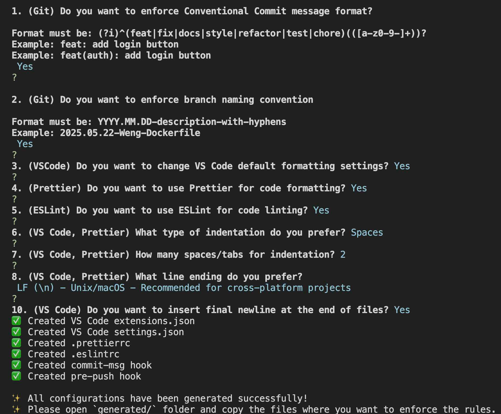
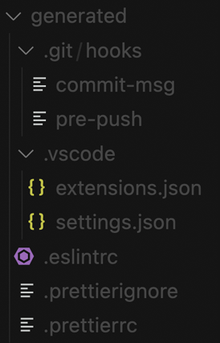
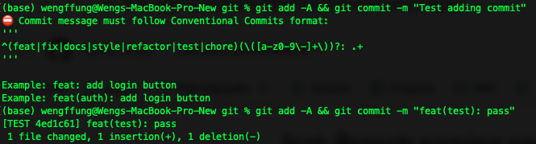
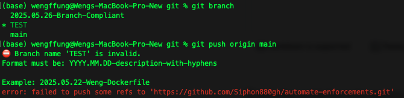

<h1 align="center">🤖 Automate Enforcements</h1>
<p align="center">
<a href="https://github.com/Siphon880gh/automate-enforcements/commits/main" target="_blank" rel="noopener"></a>
<a href="https://opensource.org/license/mit"></a>
<a target="_blank" href="https://github.com/Siphon880gh" rel="nofollow"></a>
<a target="_blank" href="https://www.linkedin.com/in/weng-fung/" rel="nofollow"></a>
<a target="_blank" href="https://www.youtube.com/@WayneTeachesCode/" rel="nofollow"></a>
</p>


> By Weng Fei Fung.
>
>A command-line tool creates configuration files for VS Code, Prettier, ESLint, and Git hooks to help teams establish and enforce consistent coding standards and Git practices.
>

## Details

I've built my tools based on best practices and standards here:
- Formating and Linting: https://codernotes.wengindustries.com/?open=_Software%20Development%20Standards%20-%20Team%20Formatting%20and%20Linting%20Standards
- Git: https://codernotes.wengindustries.com/?open=_Software%20Development%20Standards%20-%20Team%20Git%20Commit%20Naming,%20Branching,%20Merging,%20Pruning,%20Naming

The tool asks the developer lead questions about the standards they want for the team:



Generates the config files:



The developer reveals then finalizes the config files by coping them over relative to the app root. 

Testing that the rules are enforced:

- Let's make a git commit violating naming standards:


- Let's push a branch to origin that violates naming standards:


## Features

### Git Standards
- **Conventional Commits**: Enforce standardized commit message format
  - Format: `type(scope): description`
  - Types: feat, fix, docs, style, refactor, test, chore
  - Example: `feat(auth): add login button`

- **Branch Naming Convention**: Enforce consistent branch naming
  - Format: `YYYY.MM.DD-description-with-hyphens`
  - Example: `2025.05.22-Weng-Dockerfile`

### Code Quality Tools
- **Prettier**: Code formatting
  - Configurable indentation (spaces/tabs)
  - Customizable tab size
  - Line ending preferences
  - Trailing whitespace handling
  - Final newline settings

- **ESLint**: Code linting
  - Enforces consistent code style
  - Configurable rules for indentation, line breaks, quotes, and semicolons

### VS Code Integration
- Automatic VS Code settings configuration
- Recommended extensions for Prettier and ESLint
- Cover settings that Prettier and ESLint lack
- Consistent editor settings across team members

## Installation

1. Clone this repository:
```bash
git clone [repository-url]
```

2. Install dependencies:
```bash
npm install
```

## Usage

1. Run the CLI tool:
```bash
node app.js
```

2. Answer the interactive prompts to configure your preferences:
   - Git commit message format
   - Branch naming convention
   - VS Code formatting settings
   - Prettier configuration
   - ESLint rules

3. The tool will generate the following files in the `generated/` directory:
   - `.git/hooks/commit-msg` (if conventional commits enabled)
   - `.git/hooks/pre-push` (if branch naming enabled)
   - `.vscode/settings.json`
   - `.vscode/extensions.json`
   - `.prettierrc` (if Prettier enabled)
   - `.eslintrc` (if ESLint enabled)

4. Copy the generated files to your project directory to enforce the selected standards.

## Generated Files

### Git Hooks
- `commit-msg`: Enforces conventional commit message format
- `pre-push`: Enforces branch naming convention

### VS Code Configuration
- `settings.json`: Editor settings for consistent formatting
- `extensions.json`: Recommended extensions for Prettier and ESLint

### Code Quality Configuration
- `.prettierrc`: Prettier formatting rules
- `.eslintrc`: ESLint linting rules

## Contributing

Contributions are welcome! Please feel free to submit a Pull Request.

## License

MIT License

Copyright (c) 2024 Team Standards CLI

Permission is hereby granted, free of charge, to any person obtaining a copy
of this software and associated documentation files (the "Software"), to deal
in the Software without restriction, including without limitation the rights
to use, copy, modify, merge, publish, distribute, sublicense, and/or sell
copies of the Software, and to permit persons to whom the Software is
furnished to do so, subject to the following conditions:

The above copyright notice and this permission notice shall be included in all
copies or substantial portions of the Software.

THE SOFTWARE IS PROVIDED "AS IS", WITHOUT WARRANTY OF ANY KIND, EXPRESS OR
IMPLIED, INCLUDING BUT NOT LIMITED TO THE WARRANTIES OF MERCHANTABILITY,
FITNESS FOR A PARTICULAR PURPOSE AND NONINFRINGEMENT. IN NO EVENT SHALL THE
AUTHORS OR COPYRIGHT HOLDERS BE LIABLE FOR ANY CLAIM, DAMAGES OR OTHER
LIABILITY, WHETHER IN AN ACTION OF CONTRACT, TORT OR OTHERWISE, ARISING FROM,
OUT OF OR IN CONNECTION WITH THE SOFTWARE OR THE USE OR OTHER DEALINGS IN THE
SOFTWARE. 